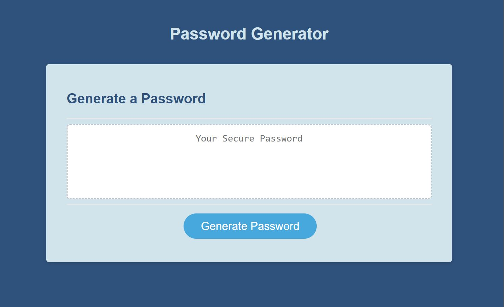

# Random Password Generator

## Description

Random Password Generator Includes:

- Clickable button to start the parameter selection process
- Text area that can be selected to copy the generated password
- Ability to choose desired password length
- Choices of lowercase, uppercase, numbers, and symbols
- validates password
- Deployed to github for public use at [https://abrowncownow.github.io/pass-gen/index.html](https://abrowncownow.github.io/pass-gen/index.html)
- Repo can be viewed at [https://github.com/abrowncownow/pass-gen](https://github.com/abrowncownow/pass-gen)

## Table of Contents

Use the links below to navigate to different sections of the README.

- [Installation](#installation)
- [Usage](#usage)
- [Credits](#credits)
- [License](#license)

## Installation

Website deployed to web via github pages. No installation necessary.

## Usage

Navigate to page in browser. Click on the 'generate password' button. Popup boxes will ask for the number of characters (8-128), if the user wants to include uppercase, lowercase, numbers, or symbols in their password. It will the randomly generate a password and display it in the text box.

## Credits

Developed by Alex Brown. Color Pallete generated using colormind.

## License

Please refer to the LICENSE in the repo.